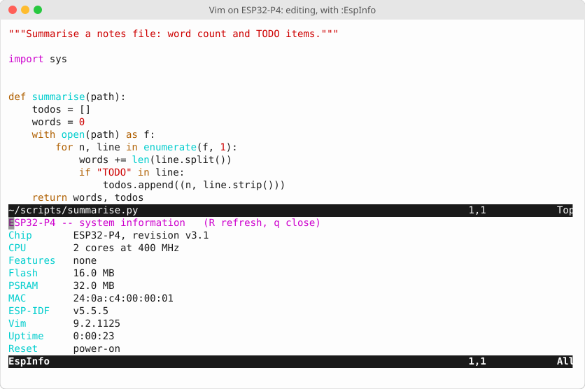
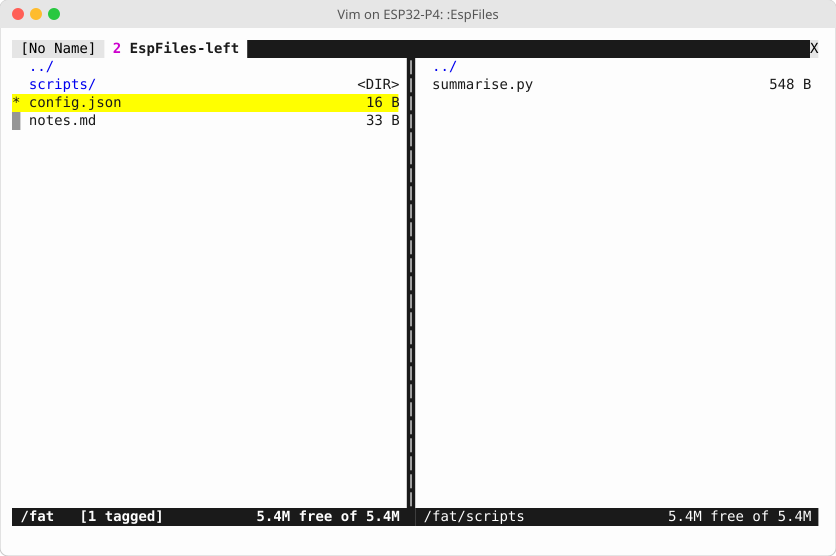

# esp-vim

**Real Vim, running as the firmware of an ESP32 microcontroller.** There is no Linux and
no computer behind it: the chip boots straight into Vim 9.2, and Vim is the whole
system. On a board with a screen and a keyboard it makes a pocket computer for writing,
scripting and tinkering with hardware; on a bare board it runs over a serial terminal.
See [Hardware](#hardware) for the boards it targets.

**Features**
- **Real Vim 9.2**: windows, buffers, registers, macros, Vim script, `:vimgrep`, diff,
  syntax highlighting and indenting for 30 file types, spell checking
- **Its own screen and keyboard**: runs on the board's display with a built-in, USB or
  Bluetooth (BLE) keyboard and touch, or on any serial terminal
- **Files everywhere**: flash, SD card, and remote machines over SCP and SFTP, in
  **`:EspFiles`**, a two-pane file manager in the style of Midnight Commander
- **File transfer**: SCP, SFTP, HTTP(S) downloads, and USB mass storage
- **Web interface**: a password-protected browser page for files and settings, with a
  live view of what's being edited
- **MicroPython**: run scripts from the editor and script Vim itself in Python
- **Git**: init, commit, diff, log, clone, fetch and push, from inside Vim
- **Hardware from the editor**: WiFi, Bluetooth, GPIO, ADC, I²C, sensors, serial ports,
  persistent settings, memory and tasks, as `:Esp` commands and functions
- **Built to be the whole system**: `:q` restarts Vim in place, a spinner shows when
  it's busy, and `:help` covers the device
- **ESP32-P4 and ESP32-S3** builds

> Development status: see the phase table in [docs/PLAN.md](docs/PLAN.md#status).

<p align="center"><br>
<em>Editing a Python script on the device, with <code>:EspInfo</code> open below.</em></p>

## How you use it

**Seeing it.** On a board with a display, Vim draws directly on it, through a terminal
emulator that runs on the chip. On any board it can also draw on a **serial terminal**: the chip's console UART carries Vim's screen, and a terminal program on
your computer displays it, like logging in to a remote machine.

**Typing.** Use the board's own keyboard if it has one, a USB keyboard, a Bluetooth
keyboard paired with `:EspBtKeyboard` (BLE keyboards only: neither chip has Bluetooth
Classic), or touch (tap to move the cursor, drag to scroll). On a touch screen with no
keyboard attached, a pairing screen appears by itself, so a Bluetooth keyboard can be
paired with taps alone. Every function-key command also has a letter, for keyboards
without F-keys. Over serial, keys typed in your terminal go down the line to Vim, mouse
included. Everything works as in
desktop Vim, including arrows, Backspace and CTRL-C.

**Files.** Your files live in flash at `/fat` and on the SD card at `/sd`, and survive
reboots. `:e`, `:w` and `<Tab>` completion work as usual, and `scp://` and `sftp://`
paths reach other machines. `:EspFiles` puts two directories side by side, local or
remote, for copying, moving and deleting:

<p align="center"></p>

To move files without the editor, plug the board into a computer over USB (it appears
as a drive), or start the web interface with `:EspWebStart` and use a browser.

**Programming it.** There are two languages. **Vim script**, with the hardware reachable
through `esp_*()` functions:

```vim
:EspWifiScan                   " nearby networks, in a window
:EspGpio 21 on                 " drive GPIO 21 high
:EspNvs app greeting hello     " store a setting that survives reboots
:echo esp_info().chip          " ESP32-P4
```

```vim
" blink GPIO 21 five times
for i in range(10)
  call esp_gpio_write(21, i % 2)
  sleep 500m
endfor
```

and **MicroPython**, which runs scripts (`:EspPyRun` runs the current buffer) and can
drive the editor through a `vim` module and the hardware through an `esp` module:

```python
# Light an LED while the current buffer has TODOs in it
import esp, vim

todos = [n for n, line in enumerate(vim.current.buffer, 1) if "TODO" in line]
esp.gpio_write(21, 1 if todos else 0)
vim.command(f"echo '{len(todos)} TODOs'")
```

There is no operating-system shell, so `:!cmd` and `:terminal` don't exist. The `:Esp`
commands and MicroPython take their place.

**Version control.** `:EspGitInit`, `:EspGitCommit`, `:EspGitDiff`, `:EspGitPush`,
`:EspGitClone` and friends keep a real git repository in `/fat` or `/sd`. It's
compatible with git on your computer, and pushes and fetches over HTTPS or SSH.

**Help.** `:help` opens a guide to the device: what's different from desktop Vim, the
`:Esp` commands, keys, storage and settings. `:q` doesn't leave you at a dead device:
Vim restarts in place.

## What it needs

| | Needed |
|---|---|
| Chip | ESP32-P4 or ESP32-S3 |
| Flash | **16 MB** |
| PSRAM | **8 MB minimum**; more leaves room for MicroPython and bigger files |

**Flash** is laid out for 16 MB: 7 MB for the firmware (2.2 MB today, with room for the
networking, MicroPython and git parts), 3 MB for Vim's runtime files (2.2 MB used: syntax,
help, plugins), about 5.5 MB for your files at `/fat`, and 64 KB for settings. An SD
card adds storage at `/sd`.

**PSRAM is required.** Vim's memory lives there, because the chip's internal RAM (a
few hundred KB at most) isn't enough. Vim uses about 0.5 MB editing a typical file and peaked near
2.7 MB in the test suite with help and syntax highlighting loaded. It's allowed up to
half of the free PSRAM (at most 16 MB), leaving the rest for everything else.

## Hardware

Targeted boards:

| Board | Chip | Flash / PSRAM | Screen and input |
|---|---|---|---|
| [M5Stack Tab5](https://docs.m5stack.com/en/core/Tab5) | ESP32-P4 | 16 MB / 32 MB | 1280×720 touch screen; clip-on keyboard (no F-keys: its `Sym` layer gives F1–F12), USB keyboards, BLE keyboards through its ESP32-C6 radio |
| ESP32-S3 "Cheap Yellow Display" (CYD) boards | ESP32-S3 | 16 MB / 8 MB required | built-in touch LCD; BLE keyboards, paired by touch |
| ESP32-S3 development boards | ESP32-S3 | 16 MB / 8 MB required | none: a serial terminal |

- **CYD boards:** only the **ESP32-S3** variants with 16 MB flash and 8 MB PSRAM (the
  module is marked **N16R8**) can run this. The original CYD, the ESP32-2432S028, uses a
  classic ESP32 with 4 MB flash and no PSRAM, which isn't enough. S3 CYDs differ in panel
  (SPI or parallel RGB, various sizes) and touch controller, so each one needs a small
  board definition.
- **ESP32-S3 PSRAM:** N16R8 modules have octal PSRAM, which is the default here. For
  quad PSRAM, set `CONFIG_SPIRAM_MODE_QUAD` in `esp-vim/sdkconfig.defaults.esp32s3`.

**Tested so far:** the ESP32-P4 and ESP32-S3 chips in Espressif's emulator, over a serial
terminal. No physical board yet. Progress is in the [plan](docs/PLAN.md#status).

## Try it in the emulator

You need Linux x86-64, [pixi](https://pixi.sh) and [Git LFS](https://git-lfs.com).

```sh
git clone https://github.com/omwah/esp-vim.git && cd esp-vim
git lfs pull              # the vendored Vim source and emulator archives
pixi install              # host tools
pixi run deps             # extract and patch upstream into build-deps/
```

Then install ESP-IDF **v5.5.5** outside the repo, from inside the pixi environment so
ESP-IDF builds its own Python environment against pixi's Python:

```sh
git clone -b v5.5.5 --depth 1 --recurse-submodules --shallow-submodules \
    https://github.com/espressif/esp-idf.git ~/esp/esp-idf
pixi run -- bash -c 'cd ~/esp/esp-idf && ./install.sh esp32p4'
pixi run -- bash -c 'cd ~/esp/esp-idf && \
    python tools/idf_tools.py install cmake ninja'   # not installed by default on Linux
pixi run env-check        # should report ESP-IDF v5.5.5 and riscv32-esp-elf 14.2.0
```

Build the firmware, start it in the emulator, and attach a terminal:

```sh
pixi run vim-build
pixi run emu esp-vim -- --uart-tcp 127.0.0.1:5555   # terminal 1: the "device"
pixi run emu-tty                                    # terminal 2: your screen and keyboard
```

Detach with `Ctrl-]`. `pixi run vim-test` runs the full regression suite in the
emulator: edits across reboots, the interactive console, `:help`, the `:Esp` commands
and the file manager.

## Put it on a board

Build as above, connect the board over USB, and flash it with ESP-IDF (the port may
differ):

```sh
pixi run vim-build            # ESP32-P4;  pixi run vim-build-s3 for ESP32-S3
pixi run -- bash -c '. scripts/env.sh && idf.py -C esp-vim -B esp-vim/build-esp32p4 -p /dev/ttyACM0 flash'
```

For an ESP32-S3 board, use `build-esp32s3`.

## For developers

### Tasks

Everything runs through pixi, so the incantations live in the repo rather than in
someone's shell history. `pixi task list` shows them all.

| Task | What |
|---|---|
| `pixi run deps` | Verify, extract and patch vendored upstream into `build-deps/` |
| `pixi run add-dep` | Onboard a new third-party archive into LFS — the only networked script |
| `pixi run env-check` | Print the active python / ESP-IDF / cross-compiler versions |
| `pixi run spike` | Build and run the Phase 1 capability spike under the emulator |
| `pixi run spike-build` | Build the spike only |
| `pixi run spike-report` | Re-record spike output into `docs/phase1-spike-results.txt` |
| `pixi run configure-vim` | Run Vim's `configure` on the host to emit a baseline `auto/config.h` |
| `pixi run runtime` | Curate `$VIMRUNTIME` into `build-deps/vimrt-<target>/` (one per chip) and generate `filetype.vim` (checks it fits the partition) |
| `pixi run vim-build` | Build the Vim firmware for ESP32-P4 (`esp-vim/build-esp32p4/`); runs `runtime` first |
| `pixi run vim-build-s3` | Build the ESP32-S3 variant (`esp-vim/build-esp32s3/`) |
| `pixi run vim-test` | **The regression gate** on ESP32-P4: builds, then round trips across reboots plus interactive console checks |
| `pixi run vim-test-s3` | The same gate on the ESP32-S3 variant |
| `pixi run vim-size` | Report the Vim component's text/data/bss |
| `pixi run screenshots` | Regenerate the README images from the firmware running in the emulator |
| `pixi run mkpatch <dep> <name>` | Turn edits in `build-deps/<dep>` into a new patch (see *Patch authoring*) |
| `pixi run emu <dir>` | Run any built project under `esp-emu` (merges the flash image first) |
| `pixi run emu-tty` | Attach a raw terminal to an emulator started with `--uart-tcp 127.0.0.1:5555` |

Extra arguments pass through after `--`:

```sh
pixi run emu esp-vim/test/spike -- --gdb 1234 --gdb-halt
```

`emu-tty` uses `socat`, not `nc` — `nc` cannot put the terminal in raw mode, so arrow
keys arrive as literal escape sequences and echo doubles. Detach with `Ctrl-]`.

### Help on the device

`:help` on the device opens a device-specific guide: an amended version of Vim's
`help.txt` covering storage, filetypes, keys, settings and what isn't available. Edit it
in `esp-vim/runtime-image/doc/help.txt.in`. The build generates the tags and rejects
broken links.

### Choosing which filetypes the device supports

Edit **`esp-vim/filetypes.conf`**: one line per filetype, followed by its file patterns.
It generates the device's `filetype.vim` and decides which syntax, ftplugin and indent
files are shipped. Then run `pixi run vim-build`. Types not listed there aren't detected
at all. To add one on a running device without reflashing, use a standard Vim
`ftdetect/` script in `/fat/.vim/ftdetect/`.

### Why the host tools are pinned

`pixi.toml` pins four host tools, each for a specific reason:

- **ncurses** — Vim's `./configure` refuses to finish without a terminal library, even
  though the ESP build deliberately runs with `HAVE_TGETENT` undefined and uses Vim's
  builtin termcaps. We only need configure to *complete* so it emits a `config.h` to
  curate.
- **socat** — raw-mode terminal for interactive sessions over the emulated UART.
- **openssh** — a local `sshd` and bare repo to test SCP/SFTP and `git push` (Phase 8).
- **python 3.13** — ESP-IDF builds its own venv with `python -m venv`, which needs
  `ensurepip`. The system Python has none, so IDF's bootstrap fails against it.

Pinning them here keeps a fresh clone reproducible and needs no root, which `apt` would.

### How third-party source is handled

Upstream source is never committed as files. Each dependency is a **Git LFS archive** in
`third_party/` plus a **patch series** in `patches/<dep>/`, extracted and applied into the
git-ignored `build-deps/` at build time. This keeps the repository reviewable, makes our
changes to upstream explicit, and makes re-syncing to a newer Vim a bounded job.

`third_party/manifest.txt` records each archive's provenance and sha256. Note the sha256
attests the blob *we vendored*, not an upstream-published digest — see the manifest header
for why that distinction is necessary.

To change upstream source: see *Patch authoring* in [docs/DECISIONS.md](docs/DECISIONS.md).

### Layout

| Path | What |
|---|---|
| `docs/` | plan, phase results, decisions; `docs/images/` is generated by `pixi run screenshots` |
| `third_party/` | LFS archives + manifest. No source files. |
| `patches/<dep>/` | our changes to upstream, applied in lexical order |
| `scripts/` | dependency prep, environment, emulator harness |
| `esp-vim/` | the ESP-IDF project (`test/spike/` is Phase 1) |
| `build-deps/` | extracted + patched upstream (git-ignored) |

## Documentation

- [docs/PLAN.md](docs/PLAN.md): the living plan, phase by phase, with status
- [docs/DECISIONS.md](docs/DECISIONS.md): why things are the way they are
- Phase write-ups: [1](docs/PHASE1.md) capability spike ·
  [2](docs/PHASE2.md) Vim compiles · [3](docs/PHASE3.md) Vim runs ·
  [4](docs/PHASE4.md) curated runtime and memory · [5](docs/PHASE5.md) interactive
  over UART, restart, S3 · [6](docs/PHASE6.md) `:Esp` commands and file manager

## License

This project's own code, scripts and documentation are licensed under the
[Apache License 2.0](LICENSE).

Third-party components keep their own licenses:

| Component | License |
|---|---|
| Vim (`third_party/vim-*.tar.gz`) and our patches to it (`patches/vim/`) | the [Vim license](https://vimhelp.org/uganda.txt.html) |
| esp-emu (`third_party/esp-emu-*.tar.gz`) | Apache-2.0, see [`third_party/licenses/esp-emu-LICENSE`](third_party/licenses/esp-emu-LICENSE) |
| ESP-IDF (fetched separately, not vendored) | Apache-2.0 |
